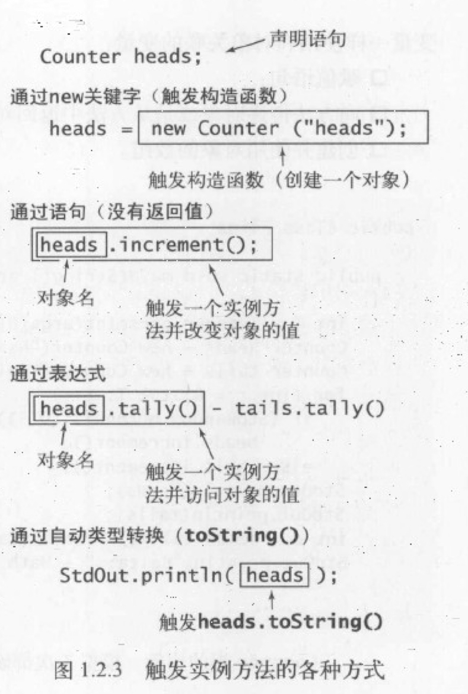

## 算法

> 算法一种有限、确定、有效的并适合计算机程序来实现的解决问题的方法。

学习算法的主要原因是它们能节约非常多的资源，甚至能够让我们完成一些不可能完成的任务。
无论在任何应用领域，精心设计的算法都是解决大型问题最有效的方法，

*在某些需要处理上百万个对象的应用程序中，设计优良的算法甚至可以将程序的运行速度提高 **数百万倍**。而花费金钱和时间去购置新的硬件可能只能将速度提高十倍或者是百倍。*

## 重载

> 重载指的是同一个函数名，传入不同参数，执行不同的操作。

```java
public class Overload {
    public static void main(String[] args) {
        System.out.println(add(1, 2)); // 3
        System.out.println(add(1, 2, 3)); // 6
        System.out.println(add(1, 2, 3, 4)); // 10
    }

    public static int add(int a, int b) {
        return a + b;
    }

    public static int add(int a, int b, int c) {
        return a + b + c;
    }

    public static int add(int a, int b, int c, int d) {
        return a + b + c + d;
    }
}
```

## API

> API（Application Programming Interface）是应用程序编程接口，是一组预先定义的函数，用于访问某些软件或硬件的功能。
> 记录库方法的用法并供他人参考的文档称为API文档。

API的目的是将调用和实现分离，使得调用者不必关心实现的细节，只需要知道如何调用即可。

我们用用例来指代调用另一个库中的方法的程序，用例是一种特殊的注释，它的格式如下：

```java
/**
 * 用例：add(1, 2)
 * 返回值：3
 */
public static int add(int a, int b) {
    return a + b;
}
```

**应当将自己编写的每一个程序都当作一个日后可以重用的库**

### 构造函数

API中可能会出现若干个名称和类名相同的方法，这些方法被称为构造函数，它们的作用是创建一个新的对象。

```java
public class Point {
    private double x;
    private double y;

    public Point(double x, double y) {
        this.x = x;
        this.y = y;
    }
}

public class PointTest {
    public static void main(String[] args) {
        Point p = new Point(1, 2);
    }
}
```
其中，`new Point(1, 2)`就是一个构造函数的调用。

new的过程：
- 为新的对象分配内存空间
- 调用构造函数初始化对象中的值
- 返回该对象的一个引用

触发实例方法的各种方式：
- 触发构造函数
- 通过语句（没有返回值）
- 通过表达式
- 通过自动类型转换(toString())


